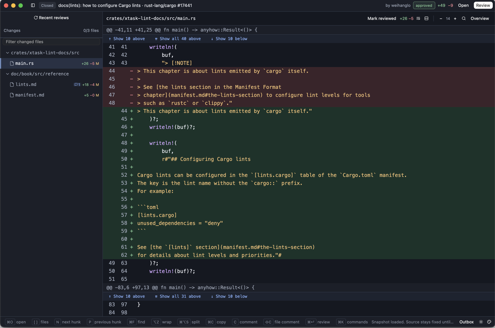

# diffz

diffz is a desktop tool that reads and reviews diffs, whether that is a GitHub
pull request, a GitLab merge request, a patch file, or changes inside a local
Git repository. The implementation is Rust, on top of [GPUI](https://www.gpui.rs).



## Features

- GitHub pull requests open via `gh`; GitLab merge requests via `glab`. It also
  reads unified diff files, the staged or unstaged state of a repository, and
  any pair of Git revisions.
- Nothing truncates long lines. Text measurement goes through the platform's
  native text system; wrapped Markdown files and minified ones select and
  scroll the way you expect.
- Views come in unified or split layout, with soft wrap, syntax colouring in 18
  languages, plus word-level marks within changed lines.
- Prose files get a rich view that lays Markdown blocks out side by side.
- Comments on lines or files begin as local drafts, kept in a SQLite store.
  Publishing to either GitHub or GitLab stays off until you enable it with a
  flag, and a preview always comes first.
- Each review is a snapshot, so the diff on screen cannot change under you.
  Refresh looks for a newer revision and, when one exists, offers it as a
  separate step.
- Light and dark themes ship in the box, and a `colors.toml` palette from
  [Omarchy](https://omarchy.org) works too, reloading live as the file changes.
  Details in [docs/themes.md](docs/themes.md).

## Installing

### Linux packages

For each published release, download Linux packages from the [GitHub Releases
page](https://github.com/zzwong/diffz/releases). The supported assets are an
x86_64 RPM, an x86_64 portable `.tar.gz` archive, an x86_64 Arch Linux package,
and distro-specific `amd64` DEBs built for Debian 12, Debian 13, Ubuntu 24.04
LTS, and Ubuntu 26.04 LTS.

Download the package matching your distribution and architecture together with
the combined `SHA256SUMS` file. Verify the downloaded package with
`sha256sum -c --ignore-missing SHA256SUMS` before installing or unpacking it.
The `--ignore-missing` option checks the matching local asset without requiring
every release asset to be downloaded.

Signed and notarized macOS downloads are not yet available. macOS 15 or newer
users must build from source using the instructions below. Unsigned local macOS
ZIPs are for testing only, are not release assets, and must not be presented as
releases.

Install and authenticate `gh` for GitHub reviews or `glab` for GitLab reviews.
Patch files and local Git comparisons do not require either provider CLI.

### Build from source

macOS and Linux desktop builds are available. See [Linux installation](docs/linux.md)
for distribution dependencies and Fedora, Arch Linux, and Omarchy packages.
Windows is not supported.

You need a Rust toolchain installed through [rustup](https://rustup.rs); it
reads the pinned version from `rust-toolchain.toml` on its own. Install `gh` or
`glab` too if you plan to look at pull requests or merge requests.

```sh
git clone https://github.com/zzwong/diffz
cd diffz
cargo build --release -p diffz
./target/release/diffz --pr rust-lang/cargo#17441
```

macOS can additionally produce an app bundle:

```sh
bash scripts/build-macos-app.sh release
open target/release/diffz.app
```

Neither signing nor notarization is applied to the bundle.


## Usage

```sh
diffz --pr owner/repo#123              # GitHub pull request
diffz --mr group/project!123           # GitLab merge request (or a full URL)
diffz --patch change.patch             # unified diff file
diffz --git /repo --base main          # main..HEAD in a local repository
diffz --staged /repo                   # the index against HEAD
diffz --worktree /repo                 # unstaged and untracked changes
diffz --resume <snapshot id>           # reopen a saved review
```

The complete option list is `diffz --help`; `diffz --doctor` reports which
external tools the machine has.

diffz treats repositories as read-only. It never checks out, stages, or writes
to them, and it makes no network calls of its own; GitHub and GitLab traffic
runs through the `gh` and `glab` you have already authenticated.

### Publishing reviews

A comment or a review summary stays a draft until you publish it. By default
publishing is off. To turn it on, start diffz passing `--allow-github-writes`;
GitLab needs `--allow-gitlab-writes`. Confirming the preview is still
required before anything leaves the machine. A local outbox keeps a record of
everything sent, so a batch cut off midway can be reconciled rather than sent
twice.

On GitLab you can publish one-line comments, summaries of reviews, and
approvals. Blocking change requests and multi-line comments do not work yet.

### Keyboard shortcuts

macOS uses `Cmd`; Linux uses `Ctrl`.

| Action | Shortcut |
| --- | --- |
| Command palette | `Cmd K` |
| Open a diff source | `Cmd O` |
| Cycle among the reviews you opened recently | `Cmd Shift O` |
| Search the diff you loaded | `Cmd F` |
| Hide or show the tree of files | `Cmd B` |
| Hide or show the review's overview panel | `Cmd I` |
| Next / previous file | `]` / `[` |
| Next / previous hunk | `N` / `P` |
| Turn soft wrap on or off | `Alt Z` |
| Turn split view on or off | `Cmd Alt S` |
| Turn the prose rich view on or off | `Cmd Shift R` |
| Draft a comment on selected lines, or the whole file when none are selected | `C` |
| Draft a comment for the whole file | `Shift C` |
| Preview your review | `Cmd Enter` |
| Look for a newer revision | `Cmd R` |
| Larger / smaller text | `Cmd =` / `Cmd -` |
| Close the open panel, or drop the current selection | `Esc` |

Scrolling past one file's last line carries on into the next file. A `+` in the
gutter starts a comment anchored to that line.

## Where data lives

Reviews you save, drafts, and settings live under
`~/Library/Application Support/diffz` on macOS, and under
`$XDG_STATE_HOME/diffz` (default `~/.local/state/diffz`) on every other
platform. Pass `--state-dir` to run against a different directory.

## Development

The optional local Kache workflow is available through the root Makefile:

```sh
make build
make check
make help
```

Four crates make up the workspace:

| Crate | Contents |
| --- | --- |
| `diffz-core` | Patch parsing, snapshot handling, layout contracts, theme palettes, syntax highlighting, and the state behind comments and reviews. No UI dependencies. |
| `diffz-adapters` | SQLite storage, a bounded subprocess runner, and adapters for Git, for GitHub (`gh`), and for GitLab (`glab`). |
| `diffz-ui` | The desktop GPUI application: the reader, the file tree, panels, the rich view, theming. |
| `diffz` | The CLI entry point, with services wired together. |

```sh
bash scripts/check.sh core     # fmt, core and adapter tests, clippy (no GPUI build)
bash scripts/check.sh native   # the above plus full workspace tests and release build
cargo build -p diffz           # rebuild the desktop binary after check.sh
```

Because `scripts/check.sh` compiles a binary that leaves out the desktop
feature, run `cargo build -p diffz` after it and before you launch the app
again. `--inspect` prints the JSON form of a loaded snapshot without opening
any window, handy for exercising the core on machines with no display.

[CONTRIBUTING.md](CONTRIBUTING.md) covers bug reports and sending changes.

## License

MIT; the full text is in [LICENSE](LICENSE), with third-party notices in
[THIRD_PARTY_NOTICES.md](THIRD_PARTY_NOTICES.md).
